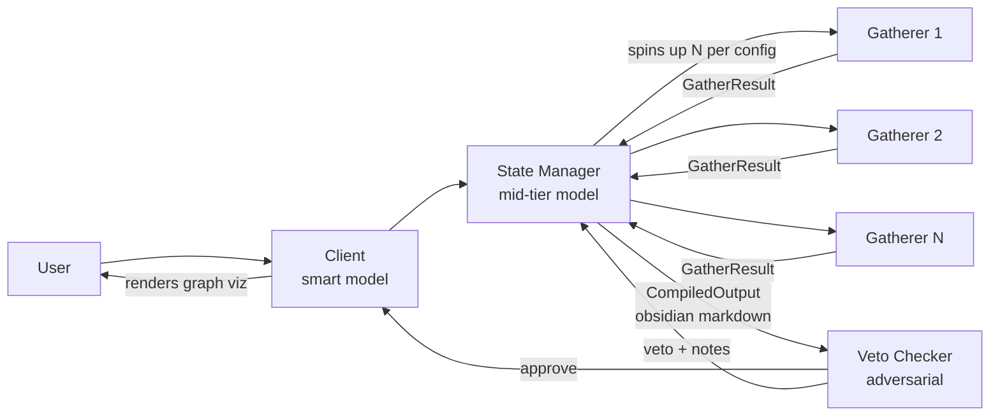

# Hackathon Plan — Agentic Enterprise Pipeline

**Category:** Fortified Enterprise Fleet (with Taskmaster elements)

## Architecture



- **Client** — interprets the user prompt, forwards to state manager, and renders the
  final Obsidian-syntax answer as an interactive graph visualization.
- **State Manager** — parses the prompt, decides which departments to pull from,
  spins up gatherers (count/limits from the environment config), synthesizes
  results into Obsidian markdown (`[[wikilinks]]` = graph edges).
- **Resource Gatherers** — fetch files from department data dirs. Deliberately
  loose matching: **over-gather, never under-gather**. Permission-scoped.
- **Veto Checker** — adversarial reviewer. Gets (original prompt, environment
  config, compiled output). Approves → user. Vetoes → back to state manager with
  revision notes, up to `veto.max_retries` times.

## Ownership

| Component | Piece | Owner |
|---|---|---|
| State Manager | Synthesize resources | Malik |
| State Manager | Spin up gatherers | Malik |
| State Manager | Output emitter (obsidian-flavored md) | **Michael** |
| Client | Parse obsidian → visualization | **Michael** |
| Gatherers | Permissions enforcement | Malik |
| Gatherers | Gathering logic | **Michael** |
| Env Config | Config parsing/validation | **Michael** |
| Veto Checker | Adversarial check + retry loop w/ state manager | **Michael** |

## The contract layer (already scaffolded — DO NOT change unilaterally)

Everything in `src/agentic/contracts/` is shared. If either of us needs to change
a schema, ping the other first. This is what lets us code in parallel:

- `contracts/messages.py` — `GatherRequest`, `GatherResult`, `CompiledOutput`,
  `VetoVerdict`, etc. Malik's spawner produces `GatherRequest`s; Michael's
  `gather()` consumes them and returns `GatherResult`s. Malik's synthesizer
  produces the data that Michael's obsidian emitter serializes.
- `contracts/config.py` — typed `EnvironmentConfig` (departments, permissions,
  gatherer limits, model ids, veto retries). Michael owns `load_config()`;
  Malik's permission checks read the parsed object, never the raw YAML.
- `config/environment.example.yaml` — the canonical config shape.

## ⚠️ FOR MICHAEL — permissions changes landed (read before you code)

Gatherer permissions are now enforced at a **mandatory gate in
`spawn.spawn_gatherers`** (Malik), not just inside the gatherer. Your
`gather()` result is post-filtered there: every `GatheredFile` is
re-verified against the permissions config and any file that fails is
stripped into `result.denied` before synthesis/output. Do not bypass the
gate — a file is readable only when ALL of these hold:

1. `config/permissions.yaml` grants the principal role the department
   (`roles.<role>.departments`), AND
2. `config/environment.yaml` lists the role in that department's
   `allowed_roles`, AND
3. the path resolves strictly inside the department's data dir
   (`permissions.check` — rejects `..`, absolute paths, Windows-style `\`,
   empty/`.` paths, and symlinks that escape).

New shared surface (contract rules apply — sync before changing):

- **New permissions config** `config/permissions.yaml` (example:
  `config/permissions.example.yaml`). Copy it in setup alongside
  `environment.yaml`. Schema lives in `agentic/gatherers/permissions.py`
  (`PermissionsConfig` / `Principal` / `RoleAccess`), not in `contracts/`.
  An unparseable permissions config fails closed at load.
- `spawn.spawn_gatherers(requests, config, permissions_cfg=None)` loads
  `config/permissions.yaml` by default; `manager.plan_and_gather` passes
  it through. The config principal role overrides any role a request
  claims — a request whose `requester_role` disagrees is denied outright.
- `manager_planning.plan_to_requests(plan, config, requester_role="analyst")`
  gained the `requester_role` kwarg (sourced from the permissions config).

Behavioural changes affecting you:

- `GathererLimits.max_files_per_gatherer` is now a **hard ceiling**:
  `min(max_files * overgather_factor, max_files_per_gatherer)` — overgather
  is advisory; never exceed the cap.
- `permissions.check()` hardened per item 3 above; the new edge-case tests
  in `tests/test_permissions.py` cover each.
- Demo setup now needs two copies:
  `cp config/environment.example.yaml config/environment.yaml` and
  `cp config/permissions.example.yaml config/permissions.yaml`.
- Cloud-backed departments (optional, `storage:` block): GCS buckets or a
  Google Drive folder per department, read through the same permission
  gate. Service account via `GOOGLE_APPLICATION_CREDENTIALS` (gitignored);
  grant it read access to exactly the buckets/folders the principal role
  may touch. Drive structure is scripted:
  `python -m agentic.gatherers.cloud.drive_setup --create-drive "AllThingsAgentic"`
  (creates the department tree, uploads samples, grants the SA, prints
  `folder_id`s for `environment.yaml`). The adapters live in
  `gatherers/cloud/` and are the only code that talks to GCP.

## AUTH + BACKEND (new, provisional — Malik)

The CLI is no longer the only entry point. `src/agentic/server/` adds a
FastAPI service with login + SSE streaming over the same pipeline.

| Piece | Owner | Status |
|---|---|---|
| `server/auth.py` — PBKDF2 password verify, JWT issue/verify, users store | Malik | provisional |
| `config/users.example.yaml` + `scripts/hash_password.py` | Malik | provisional |
| `server/app.py` (`POST /api/login`, `POST /api/run` SSE) · `schemas.py` · `sse.py` | Malik | provisional |
| `server/runs.py` — run orchestration | Malik | **provisional, see diff 2 below** |
| `permissions.load_permissions_config(..., principal_role=)` override | Malik | lands in permissions gate, fail-closed |
| `manager.plan_and_gather(..., requester_role=)` threading | Malik | |
| `gather.gather(request, config, permissions_cfg=None)` | ⚠️ **Michael's file** | **flagged diff 1 below** |
| `pipeline.run(requester_role=None, emit=None)` | ⚠️ **Michael's file** | **flagged diff 2 below** |

How auth works: login checks `config/users.yaml` (PBKDF2 hashes) and that
the user's role exists in `config/permissions.yaml` roles — fail closed.
A JWT `{sub, role}` comes back stateless; `/api/run` verifies it and the
role becomes the run's principal for EVERY permission gate (spawn gate
still re-verifies; nothing trusts request bodies or model output).

SSE event contract (what the frontend builds against): `run_started`,
`gatherer_result`, `gathered`, `synthesized`, `veto`, `revising`,
`run_state` (final: markdown, sources, verdict, attempts, `viz_url`),
`error`.

### ⚠️ FOR MICHAEL — two flagged diffs awaiting you

Both are strictly additive kwargs; until you land them the demo still
works (the spawn gate enforces the authenticated role regardless), but:

**Diff 1 — gather.py:** without your change, the *gatherer's* pre-gate
reads the YAML principal instead of the authenticated one. With
`principal: admin` in permissions.yaml an analyst run's gatherer briefly
touches locked content inside LLM context before the spawn gate strips
it — outputs stay correct, but scope should never even reach the model.
Please land:

```python
# gather.py — additive default, behaviour unchanged for existing callers
async def gather(request, config, permissions_cfg=None):
    ...
    perms = permissions_cfg or permissions.load_permissions_config()
```
(spawn passes its already-overridden config down; manager wires it.)

**Diff 2 — pipeline.run():** the server currently carries a REPLICA of
your veto retry loop in `server/runs.py` because we agreed not to touch
your files. When you land this, I delete the replica and call your
`run()` directly — event names stay identical:

```python
# pipeline.py — additive defaults, CLI path identical
async def run(prompt, config_path="config/environment.yaml",
              out_path=DEFAULT_OUT, requester_role=None, emit=None):
    # emit(event_name, payload_dict) fires wherever _log() does today;
    # None keeps stderr-only logging.
```

### Server setup

```bash
cp config/users.example.yaml config/users.yaml   # then replace demo hashes:
python scripts/hash_password.py                  # prompts securely
export AGENTIC_JWT_SECRET=$(python -c "import secrets;print(secrets.token_hex(32))")
AGENTIC_JWT_SECRET=$AGENTIC_JWT_SECRET .venv/bin/uvicorn agentic.server.app:create_app --factory --port 8000
```

Optional env: `AGENTIC_CONFIG_PATH` (default `config/environment.yaml`),
`AGENTIC_USERS_PATH`, `AGENTIC_GRAPHS_DIR`, `AGENTIC_JWT_TTL_HOURS`
(default 12), `AGENTIC_DEV_CORS=1` (dev frontend on another origin).

Demo beats: log in as alice (analyst) vs root (admin), ask about HR comp
bands — analyst sees live denials in the timeline, admin gets the answer;
graph viz link lands with the final event.

## Michael's build order

> **Status 2026-08-19: all five sections DONE**, plus `pipeline.py` run()/CLI and
> the test suite (77 passing; 3 live-API tests skip without keys). Deviations from
> the plan below, all deliberate: gather.py reads full files and assesses content
> (manifest-selection only for oversized departments) instead of filename-picking;
> the checker also receives the raw `GatherResult`s so it verifies claims against
> source text; viz.py uses vendored vis-network (`client/vendor/` — keep it
> committed or rendering breaks). Cloud-backed departments are **not yet routed**
> by gather.py (deferred — reachable only via the reference gatherer's fallback).
> Remaining: first live end-to-end run (`python -m agentic.pipeline "..."` — no
> real model call has executed yet) and the demo rehearsal below.

1. **Config parsing** (`contracts/config.py::load_config`) — first, because both
   of you depend on the parsed config. YAML → pydantic `EnvironmentConfig` with
   validation errors that actually say what's wrong. ~45 min.
2. **Output emitter** (`state_manager/output.py`) — takes the synthesized
   answer + source list, emits markdown: YAML frontmatter, `[[Department/file]]`
   wikilinks for every source, `#tags` for departments. Pure function, no LLM —
   easy to unit test before Malik's synthesizer exists (feed it a hand-written
   `CompiledOutput`). ~1 hr.
3. **Client viz** (`client/viz.py`) — our own visualizer, not the Obsidian app:
   parse the obsidian-flavored markdown (regex for `[[...]]` and headings),
   build nodes/edges, write a self-contained HTML file with a force-directed
   graph (vis-network or d3). This is the demo money shot;
   make links between the answer node, department nodes, and file nodes. ~2 hr.
4. **Gathering** (`gatherers/gather.py`) — given a `GatherRequest`, use a Gemini
   Flash call (cheap model) to pick candidate files from a directory listing,
   read them, return `GatherResult`. Bias loose: include anything plausibly
   relevant. Works standalone against `data/departments/` fixtures. ~1.5 hr.
5. **Veto checker** (`veto/checker.py`) — adversarial system prompt, gets
   (prompt, config, compiled output), returns `VetoVerdict`. Then the retry loop
   in `pipeline.py`: veto → `state_manager.revise(verdict)` → re-check, capped
   at `max_retries`. ~1.5 hr.

Each step is testable in isolation — none blocks on Malik's code because the
contracts define fake inputs you can hand-write.

## Malik's integration points (what he codes against)

- `spawn.py`: build `list[GatherRequest]` from the parsed prompt + config, fan
  out calls to `gather.gather(request, config)` (async), collect `GatherResult`s.
- `manager.py::synthesize`: `list[GatherResult]` → answer text + sources, then
  call `output.emit(...)` to get the `CompiledOutput`.
- `permissions.py`: filter/deny inside gathering using `config.departments[*].allowed_roles`.
- `manager.py::revise`: take a `VetoVerdict`, redo synthesis with the notes.

## Models

- Client + Veto: strong model (Claude) — Anthropic API.
- State Manager: mid-tier (Gemini Pro-class or Flash w/ thinking).
- Gatherers: Gemini Flash (cheap, parallel). Hackathon requires Gemini in the
  loop — gatherers + state manager cover that; ADK (`google-adk`) is the
  recommended framework for those agents.

## Demo script

1. Show `config/environment.yaml` (departments, permissions, gatherer caps,
   optional cloud `storage:` backends).
2. Ask a cross-department question ("summarize Q3 engineering spend vs finance
   budget") — pulls local or GCS/Drive departments through the same gate.
3. Watch gatherers fan out (log lines), veto checker reject once (rig a strict
   pass), state manager revise, approve.
4. Optional cloud denial beat: ask something in the locked `hr` department
   (Drive folder the SA isn't granted) — denied by config AND GCP IAM.
5. Open the generated graph viz — answer node linked to every source file.
