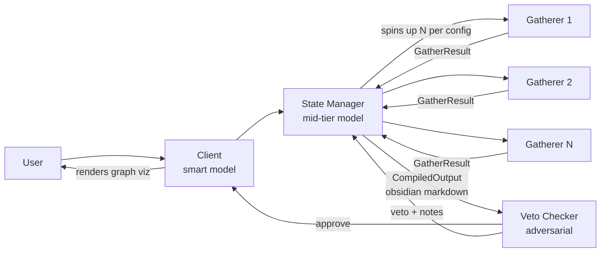

# Hackathon Plan — Agentic Enterprise Pipeline

**Category:** Fortified Enterprise Fleet (with Taskmaster elements)

## Architecture

- **Client** — interprets the user prompt, forwards to state manager, and renders the
  final Obsidian-syntax answer as an interactive graph visualization.
- **State Manager** — parses the prompt, decides which departments to pull from,
  spins up gatherers (count/limits from the environment config), synthesizes
  results into Obsidian markdown (`[[wikilinks]]` = graph edges).
- **Resource Gatherers** — fetch files from department data dirs. Deliberately
  loose matching: **over-gather, never under-gather**. Permission-scoped.
- **Veto Checker** — adversarial reviewer. Gets (original prompt, environment
  config, compiled output). Approves → user. Vetoes → back to state manager with
  revision notes, up to `veto.max_retries` times.

## Ownership

| Component | Piece | Owner |
|---|---|---|
| State Manager | Synthesize resources | Malik |
| State Manager | Spin up gatherers | Malik |
| State Manager | Output emitter (obsidian-flavored md) | **Michael** |
| Client | Parse obsidian → visualization | **Michael** |
| Gatherers | Permissions enforcement | Malik |
| Gatherers | Gathering logic | **Michael** |
| Env Config | Config parsing/validation | **Michael** |
| Veto Checker | Adversarial check + retry loop w/ state manager | **Michael** |

## The contract layer (already scaffolded — DO NOT change unilaterally)

Everything in `src/agentic/contracts/` is shared. If either of us needs to change
a schema, ping the other first. This is what lets us code in parallel:

- `contracts/messages.py` — `GatherRequest`, `GatherResult`, `CompiledOutput`,
  `VetoVerdict`, etc. Malik's spawner produces `GatherRequest`s; Michael's
  `gather()` consumes them and returns `GatherResult`s. Malik's synthesizer
  produces the data that Michael's obsidian emitter serializes.
- `contracts/config.py` — typed `EnvironmentConfig` (departments, permissions,
  gatherer limits, model ids, veto retries). Michael owns `load_config()`;
  Malik's permission checks read the parsed object, never the raw YAML.
- `config/environment.example.yaml` — the canonical config shape.

## Michael's build order

1. **Config parsing** (`contracts/config.py::load_config`) — first, because both
   of you depend on the parsed config. YAML → pydantic `EnvironmentConfig` with
   validation errors that actually say what's wrong. ~45 min.
2. **Output emitter** (`state_manager/output.py`) — takes the synthesized
   answer + source list, emits markdown: YAML frontmatter, `[[Department/file]]`
   wikilinks for every source, `#tags` for departments. Pure function, no LLM —
   easy to unit test before Malik's synthesizer exists (feed it a hand-written
   `CompiledOutput`). ~1 hr.
3. **Client viz** (`client/viz.py`) — our own visualizer, not the Obsidian app:
   parse the obsidian-flavored markdown (regex for `[[...]]` and headings),
   build nodes/edges, write a self-contained HTML file with a force-directed
   graph (vis-network or d3). This is the demo money shot;
   make links between the answer node, department nodes, and file nodes. ~2 hr.
4. **Gathering** (`gatherers/gather.py`) — given a `GatherRequest`, use a Gemini
   Flash call (cheap model) to pick candidate files from a directory listing,
   read them, return `GatherResult`. Bias loose: include anything plausibly
   relevant. Works standalone against `data/departments/` fixtures. ~1.5 hr.
5. **Veto checker** (`veto/checker.py`) — adversarial system prompt, gets
   (prompt, config, compiled output), returns `VetoVerdict`. Then the retry loop
   in `pipeline.py`: veto → `state_manager.revise(verdict)` → re-check, capped
   at `max_retries`. ~1.5 hr.

Each step is testable in isolation — none blocks on Malik's code because the
contracts define fake inputs you can hand-write.

## Malik's integration points (what he codes against)

- `spawn.py`: build `list[GatherRequest]` from the parsed prompt + config, fan
  out calls to `gather.gather(request, config)` (async), collect `GatherResult`s.
- `manager.py::synthesize`: `list[GatherResult]` → answer text + sources, then
  call `output.emit(...)` to get the `CompiledOutput`.
- `permissions.py`: filter/deny inside gathering using `config.departments[*].allowed_roles`.
- `manager.py::revise`: take a `VetoVerdict`, redo synthesis with the notes.

## Models

- Client + Veto: strong model (Claude) — Anthropic API.
- State Manager: mid-tier (Gemini Pro-class or Flash w/ thinking).
- Gatherers: Gemini Flash (cheap, parallel). Hackathon requires Gemini in the
  loop — gatherers + state manager cover that; ADK (`google-adk`) is the
  recommended framework for those agents.

## Demo script

1. Show `config/environment.yaml` (departments, permissions, gatherer caps).
2. Ask a cross-department question ("summarize Q3 engineering spend vs finance
   budget").
3. Watch gatherers fan out (log lines), veto checker reject once (rig a strict
   pass), state manager revise, approve.
4. Open the generated graph viz — answer node linked to every source file.
